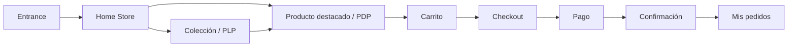

# Propuesta de experiencia, contenido y plan de implementación — Home Store GoToGym

**Documento de dirección de diseño, UX, e-commerce, marca, motion y arquitectura técnica**  
**Versión:** 1.0 · **Fecha:** 22 de septiembre de 2026 · **Alcance:** Home autenticado del store

---

## 1. Resumen ejecutivo

GoToGym ya cuenta con una identidad visual reconocible y con una base transaccional capaz de sostener una experiencia comercial real. La oportunidad no consiste en añadir más enlaces a la pantalla actual, sino en convertir el Home autenticado en una **portada editorial de comercio**: debe orientar, despertar deseo, explicar el diferencial tecnológico y llevar al producto con el mínimo esfuerzo.

La propuesta conserva la entrada pública como experiencia ceremonial y transforma el Home del store en una interfaz útil, aspiracional y medible. La órbita deja de ser el menú: se convierte en un **campo gravitacional ambiental**, inspirado en lentes gravitacionales, geodésicas y fluctuaciones de partículas. El producto, las personas y las decisiones de compra ocupan el primer plano.

### Decisión rectora

> **La entrada presenta el universo GoToGym. El Home ayuda a decidir. El Store hace desear. El producto convence. El checkout desaparece. La cuenta da control.**

### Resultado esperado

- Una sola historia de marca: lujo funcional, tecnología textil y bienestar personalizado.
- Una ruta principal inequívoca: **Home → colección → producto → carrito → checkout**.
- Mayor visibilidad de producto y menos carga cognitiva.
- Uso editorial de las fotografías existentes, con un tratamiento visual consistente.
- Una animación Quantum distintiva, accesible y de bajo costo de renderizado.
- Una arquitectura preparada para personalización, automatización y experimentación.

---

## 2. Diagnóstico y principio de experiencia

El Home autenticado actual repite el lenguaje orbital de la entrada y distribuye acciones de comercio, cuenta, contacto e influencers con una jerarquía similar. El usuario ya atravesó la puerta de marca, pero recibe una segunda puerta en vez de un destino.

La solución separa tres modos de experiencia:

| Capa | Propósito | Lenguaje | Navegación principal |
|---|---|---|---|
| **Entrance** | Presentar el universo y autenticar | Inmersivo, ceremonial, oscuro | Entrar, crear cuenta, explorar |
| **Commerce** | Descubrir, comparar y comprar | Editorial, visual, directo | Home, Store, PDP, carrito, checkout |
| **Account** | Consultar y gestionar | Calmado, compacto, funcional | Pedidos, perfil, seguridad, soporte |

### Principios del nuevo Home

1. **Producto primero:** las prendas y sus beneficios ocupan más espacio que los controles.
2. **Una decisión dominante por bloque:** cada sección tiene un objetivo y un CTA.
3. **Quantum como ambiente:** comunica identidad sin competir con el contenido.
4. **Tecnología explicada en beneficios:** evitar jerga o promesas científicas no demostrables.
5. **Progresión narrativa:** descubrir → creer → explorar → comprar → pertenecer.
6. **Rendimiento y accesibilidad como parte del lujo:** rapidez, legibilidad y control del movimiento.

---

## 3. Posicionamiento y promesa de marca

### Territorio

**GoToGym es sportwear de alta tecnología para el rendimiento y el bienestar, diseñado alrededor de cada persona.**

### Propuesta de valor

GoToGym une diseño deportivo, personalización y tecnología textil en prendas que acompañan el movimiento dentro y fuera del entrenamiento.

### Pilares editoriales

- **Rendimiento:** diseño pensado para moverse.
- **Personalización:** una experiencia más cercana a cada cuerpo, contexto y estilo.
- **Tecnología:** materiales, construcción y servicios conectados con propósito.
- **Versatilidad:** del entrenamiento a la vida diaria.
- **Bienestar:** progreso sostenible, sin discursos de culpa ni perfección.

### Tono de voz

- Seguro, breve y humano.
- Premium sin ser distante.
- Tecnológico sin sonar clínico.
- Motivador sin prometer transformaciones irreales.
- Español claro; usar “Store” sólo si se adopta formalmente como nombre de producto. Para navegación se recomienda **Tienda**.

### Vocabulario recomendado

**Usar:** movimiento, diseño, precisión, rendimiento, bienestar, personalización, materiales, colección, acompaña.  
**Evitar:** milagroso, cuántico como propiedad médica, cambia tu cuerpo, resultados garantizados, tecnología revolucionaria sin evidencia.

---

## 4. Redacción propuesta del Home

La siguiente es la versión lista para diseño y posterior implementación.

### 4.1 Header

- Marca: **GoToGym**
- Navegación: **Novedades · Mujer · Hombre · Tecnología · Journal**
- Utilidades: **Buscar · Carrito · Cuenta**
- En móvil: menú, marca, buscar, carrito y cuenta; navegación dentro del panel.

### 4.2 Hero — primer viewport

**Eyebrow**  
NUEVA GENERACIÓN · GOTOGYM X5

**Título**  
## Diseñada para tu forma de avanzar.

**Texto**  
Sportwear de alta tecnología que une precisión, movimiento y estilo. Descubre prendas creadas para rendir contigo, dentro y fuera del entrenamiento.

**CTA primario**  
**Descubrir la colección**

**CTA secundario**  
Conocer la tecnología

**Prueba de confianza, bajo los CTA**  
Diseño colombiano · Compra segura · Envíos nacionales

> La fotografía debe liderar; el campo Quantum se mantiene detrás del contenido, nunca encima del rostro ni de la prenda.

### 4.3 Accesos por intención

**Título**  
## Encuentra tu próximo movimiento

**Introducción**  
Diseño técnico para entrenar, trabajar y vivir con la misma intención.

**Tarjetas**

1. **Rendimiento**  
   Prendas diseñadas para acompañar intensidad, movilidad y recuperación.  
   CTA: **Explorar rendimiento**
2. **Movimiento diario**  
   Comodidad técnica y presencia para todo lo que ocurre después del entrenamiento.  
   CTA: **Ver esenciales**
3. **Ediciones personalizadas**  
   Diseño, ajuste y detalles creados para una expresión verdaderamente propia.  
   CTA: **Conocer personalización**

### 4.4 Productos destacados

**Eyebrow**  
SELECCIÓN GOTOGYM

**Título**  
## Tecnología que se siente en movimiento

**Texto**  
Una selección de piezas versátiles para construir tu ritmo.

Mostrar inicialmente cuatro productos `featured`, con imagen 4:5, nombre editorial, línea, precio y variantes disponibles. La tarjeta completa es clicable; no repetir un botón grande en cada producto.

**CTA de sección**  
**Ver toda la tienda**

### 4.5 Historia de tecnología

**Eyebrow**  
GOTOGYM TECHNOLOGY

**Título**  
## Innovación que trabaja alrededor de ti.

**Texto**  
Exploramos materiales, construcción y diseño personalizado para crear prendas que respondan mejor al movimiento y se integren con naturalidad a tu día.

**Tres evidencias cortas**

- **Diseño funcional:** cada detalle responde a una necesidad de movimiento.
- **Personalización consciente:** opciones que acercan la prenda a tu contexto y estilo.
- **Evolución continua:** aprendemos del uso para diseñar mejores experiencias.

**CTA**  
**Descubrir GoToGym Technology**

> Antes de publicar afirmaciones específicas sobre grafeno, termorregulación, sensores o salud, el equipo debe asociarlas a una ficha técnica, ensayo o fuente aprobada por legal/producto.

### 4.6 Bloque editorial / bienestar empresarial

**Eyebrow**  
BIENESTAR EN MOVIMIENTO

**Título**  
## Equipos que se mueven mejor, conectan mejor.

**Texto**  
Experiencias y prendas para organizaciones que entienden el bienestar como parte de su cultura.

**CTA primario**  
**Conocer bienestar empresarial**

**CTA secundario**  
Hablar con GoToGym

### 4.7 Journal

Si existen publicaciones:

**Título:** Historias para avanzar  
**Texto:** Diseño, rendimiento, tecnología y bienestar desde la mirada GoToGym.  
Mostrar una historia principal y dos secundarias.

Si no existen publicaciones, no mostrar filtros ni una grilla vacía:

**Título:** Estamos preparando GoToGym Journal  
**Texto:** Muy pronto encontrarás historias sobre diseño, rendimiento, tecnología y bienestar.  
**CTA:** **Mientras tanto, descubre la colección**

### 4.8 Cierre comercial

**Título**  
## Tu movimiento. Tu diseño. Tu GoToGym.

**Texto**  
Descubre una colección creada para acompañar la manera única en que avanzas.

**CTA**  
**Entrar a la tienda**

### 4.9 Footer

- Colecciones: Mujer, Hombre, Novedades, Personalización.
- Ayuda: Envíos, cambios y devoluciones, contacto, preguntas frecuentes.
- Marca: Acerca de, Tecnología, Journal, programa de influencers.
- Legal: privacidad, términos, tratamiento de datos.
- Redes con destinos reales.
- Newsletter sólo cuando exista una suscripción persistente y consentimiento verificable; hasta entonces, ocultarla.

---

## 5. Dirección visual y sistema editorial

### 5.1 Paleta oficial

| Rol | Token sugerido | Color | Uso |
|---|---|---:|---|
| Fondo principal | `--gtg-graphite` | `#101012` | Hero, navegación, cierres |
| Superficie | `--gtg-carbon` | `#404045` | Paneles y superficies elevadas |
| Texto claro | `--gtg-premium-white` | `#F8F9FA` | Títulos y contenido sobre oscuro |
| Texto oscuro | `--gtg-ink` | `#101012` | Contenido sobre claro |
| Tecnología | `--gtg-graphene` | `#0FBFB0` | Foco, estados activos y trazas Quantum |
| Lujo | `--gtg-fitness-gold` | `#D4B46A` | Detalles editoriales y selección |
| Confianza | `--gtg-sapphire` | `#17375C` | Secciones informativas y profundidad |
| Innovación | `--gtg-cobalt` | `#284F7E` | Gradientes y enlaces secundarios |
| Personalización | `--gtg-emerald` | `#1A9B76` | Línea personalizada |
| Exclusividad | `--gtg-royal-purple` | `#69324F` | Cápsulas o ediciones limitadas |

**Regla:** turquesa y dorado son acentos, no fondos extensos. Ninguno se usará como texto pequeño sobre blanco sin comprobar contraste WCAG AA.

### 5.2 Tipografía

- **Marca:** TT Norms, únicamente si existe licencia web y archivos autorizados.
- **Fallback digital aprobado:** Outfit, que ya está servido localmente.
- Escala sugerida: `clamp(2.75rem, 7vw, 6.75rem)` para H1; 48/56 para H2 desktop; 32/38 móvil; cuerpo 18/28; metadata 13/18.
- Limitar texto largo a 60–70 caracteres por línea.
- Evitar el brillo exterior en párrafos: reservarlo para una palabra o detalle excepcional.

### 5.3 Retícula y ritmo

- Contenedor máximo: 1440 px; área editorial: 1280 px.
- Márgenes fluidos: 20 px móvil, 32 px tablet, 64–80 px desktop.
- Sistema de espaciado base 8 px.
- Hero: mínimo 760 px en desktop y `100svh` con límites seguros; no fijar alturas que recorten contenido.
- Productos: 2 columnas móvil ancho, 3 columnas tablet/desktop medio, 4 sólo desde 1440 px.
- Imágenes de producto: relación 4:5; escenas editoriales: 3:2 o 16:9 según bloque.

### 5.4 Componentes

- Header flotante y después sólido al hacer scroll.
- Botón primario grafito/blanco o blanco/grafito; acento turquesa sólo para foco y hover.
- Botón secundario textual con flecha y subrayado animado.
- Cards sin exceso de bordes; fotografía, espacio y tipografía crean la jerarquía.
- Badges sólo para información útil: Nuevo, edición limitada, bajo stock.
- Estados de foco visibles en turquesa con separación mínima de 2 px.

---

## 6. Curaduría y mejora de `Imagenes Home`

Las nueve fotografías disponibles son material documental valioso, pero necesitan una edición común antes de usarse como campaña. Se recomienda crear derivados web y conservar los originales intactos.

| Archivo actual | Uso propuesto | Encuadre/transformación |
|---|---|---|
| `WhatsApp Image 2026-07-21 at 6.53.20 PM (2).jpeg` | Hero principal desktop | Recorte 16:10; modelo al tercio derecho; espacio negativo a la izquierda para copy |
| `bienestar_empresarial_5.jpeg` | Hero móvil o bloque lifestyle | Recorte 4:5; mantener gesto natural; limpiar fondo sin plastificar piel |
| `WhatsApp Image 2026-07-21 at 6.53.19 PM (8).jpeg` | Tecnología / detalle de prenda | Recorte 3:2 o 4:5; priorizar cierre, paneles y textura |
| `WhatsApp Image 2026-07-21 at 6.53.20 PM (4).jpeg` | Prueba social / evento de marca | Recorte 4:5; corregir luces del fondo y preservar logotipo legible |
| `WhatsApp Image 2026-07-21 at 6.53.20 PM (6).jpeg` | Comunidad / dúo | Recorte 4:5; corregir dominante cálida y fondo reflectante |
| `bienestar_empresarial_3.jpeg` | Bienestar empresarial | Recorte 16:9; conservar al grupo y dejar zona para título |
| `bienestar_empresarial_4.jpeg` | Bienestar empresarial móvil | Recorte 4:5; reducir protagonismo de la pantalla posterior |
| `WhatsApp Image 2026-07-21 at 6.53.18 PM (4).jpeg` | Cápsula hombre / editorial | Recorte 4:5; priorizar patrón de la prenda |
| `WhatsApp Image 2026-07-21 at 6.53.19 PM (1).jpeg` | Movimiento diario / tailoring | Recorte 4:5; mantener la mezcla sport–formal |

### Flujo de mejora no destructivo

1. Balance de blancos neutro y exposición homogénea entre la serie.
2. Reducción moderada de ruido y corrección de perspectiva/fondo.
3. Corrección de piel natural; no alterar cuerpos ni características personales.
4. Contraste local sobre textiles para mostrar construcción y textura.
5. Gradación fría muy sutil en sombras (`#17375C`) y luces cálidas controladas (`#D4B46A`).
6. Crear máscaras suaves de fondo cuando el texto comparta el encuadre.
7. Exportar AVIF y WebP, más JPEG de respaldo, en anchos 480, 768, 1200, 1600 y 2000 px.
8. Definir `width`, `height`, `srcset` y `sizes`; el hero se precarga, el resto usa lazy loading.
9. Meta de peso: hero ≤ 300 KB en desktop y ≤ 180 KB en móvil; cards editoriales ≤ 140 KB.
10. Renombrar derivados con nombres semánticos, por ejemplo `home-x5-hero-1200.webp`; no exponer nombres de WhatsApp en URLs nuevas.

### Producción fotográfica futura

Las imágenes actuales pueden lanzar el MVP. Para una segunda versión, producir una campaña con iluminación, fondos y dirección de pose consistentes: macros de materiales, prenda en movimiento, retrato lifestyle y escena empresarial. La promesa de “alta tecnología” necesita evidencia visual cercana del textil, no sólo retratos.

---

## 7. Animación de fondo: Campo Gravitacional Quantum

### Concepto

La animación representa un espacio-tiempo estilizado: una malla de líneas se curva de manera suave alrededor de un núcleo fuera de centro, pequeñas partículas siguen trayectorias geodésicas y un arco luminoso sugiere lente gravitacional. No intenta simular física con precisión ni atribuir propiedades cuánticas a las prendas; es una metáfora visual propia de marca.

### Capas visuales

1. **Vacío de grafito:** gradiente radial `#101012 → #090A0D`.
2. **Malla gravitacional:** 12–18 curvas finas en zafiro/cobalto, opacidad 6–14 %.
3. **Lente:** uno o dos arcos turquesa, desenfoque ligero, opacidad máxima 20 %.
4. **Partículas:** 24–40 puntos de 1–2 px que avanzan lentamente por curvas precalculadas.
5. **Núcleo ausente:** el centro no se dibuja como agujero negro literal; una oclusión y la deformación sugieren masa.
6. **Respuesta al puntero:** desplazamiento máximo de 8 px, sólo en dispositivos con puntero preciso.

### Comportamiento

- Ciclo base de 28–40 segundos, sin salto perceptible.
- El campo se desplaza a un máximo equivalente de 12 px/segundo.
- Al hacer scroll, el campo pierde opacidad; la imagen y el producto mantienen prioridad.
- No reaccionar al scroll con movimiento brusco ni usar parallax en móvil.
- La interacción nunca altera posición, tamaño o legibilidad de los CTA.

### Implementación recomendada

- **MVP:** SVG inline con `path`, gradientes y animaciones CSS de `stroke-dashoffset`, `transform` y `opacity`.
- **Mejora progresiva:** Canvas 2D únicamente para partículas; limitar `devicePixelRatio` a 1.5 y pausar con `IntersectionObserver` cuando el hero no sea visible.
- No usar WebGL en la primera entrega: agrega costo, riesgo y consumo energético sin validar aún su efecto comercial.
- Encapsular en un componente `QuantumField` sin dependencia del contenido del hero.

### Accesibilidad y rendimiento

```css
@media (prefers-reduced-motion: reduce) {
  .quantum-field * {
    animation: none !important;
  }
}
```

- Con movimiento reducido, mostrar una composición SVG estática.
- Todo el campo es decorativo: `aria-hidden="true"` y `pointer-events: none`.
- Objetivo: ≤ 2 % de scripting sostenido en un portátil medio y cero cambios de layout.
- Presupuesto de experiencia: LCP ≤ 2.5 s, CLS ≤ 0.1, INP ≤ 200 ms en p75 móvil.
- Validar contraste del copy con una capa local, no oscureciendo toda la fotografía.

---

## 8. Arquitectura de información

```text
GoToGym
├── Entrance pública
│   ├── Entrar
│   ├── Crear cuenta
│   └── Explorar como visitante
├── Home Store
│   ├── Hero / colección vigente
│   ├── Comprar por intención
│   ├── Productos destacados
│   ├── GoToGym Technology
│   ├── Bienestar empresarial
│   └── Journal
├── Tienda
│   ├── Novedades
│   ├── Mujer
│   ├── Hombre
│   ├── Personalización
│   └── Resultados / filtros
├── Producto (PDP)
│   ├── Galería
│   ├── Variantes y disponibilidad
│   ├── Beneficios / ficha técnica
│   ├── Envío, cambios y garantía
│   └── Recomendaciones
├── Compra
│   ├── Carrito
│   ├── Checkout
│   ├── Pago
│   └── Confirmación
├── Cuenta
│   ├── Pedidos
│   ├── Perfil
│   ├── Seguridad
│   └── Soporte
└── Institucional
    ├── Acerca de
    ├── Tecnología
    ├── Journal
    ├── Bienestar empresarial
    ├── Programa de influencers
    └── Políticas
```

**Influencers se conserva como programa institucional**, pero sale del Home del comprador y del camino crítico de compra.

### Flujo principal



---

## 9. Arquitectura funcional y técnica

### 9.1 Composición de página

```text
logged_home.html
├── app_shell / base.html
│   ├── CommercialHeader
│   └── CommercialFooter
├── QuantumHero
│   ├── QuantumField (decorativo)
│   ├── ResponsiveEditorialImage
│   └── HeroCopy + CTA
├── IntentCollections
├── FeaturedProductRail
│   └── ProductCard (componente compartido con PLP)
├── TechnologyStory
├── CorporateWellnessStory
├── JournalPreview / JournalEmptyState
└── CommercialClosingCTA
```

### 9.2 Contrato de datos sugerido

La vista del Home debe entregar datos reales y degradar con elegancia:

```python
context = {
    "hero_campaign": {...},
    "intent_collections": [...],
    "featured_products": Product.objects.filter(featured=True),
    "latest_posts": Post.objects.filter(is_published=True)[:3],
    "user_first_name": request.user.first_name,
}
```

- Limitar destacados a 4 en servidor y precargar relaciones/media para evitar N+1.
- Si no hay destacados, usar productos disponibles recientes; nunca mostrar una sección vacía.
- Si no hay posts, renderizar el estado editorial definido en este documento.
- Las imágenes editoriales comienzan como configuración versionada; migrarlas a CMS sólo cuando exista operación de contenidos.

### 9.3 Separación de responsabilidades

- **Django:** selección de contenido, catálogo, sesión, disponibilidad, rutas y analítica server-side.
- **Template:** HTML semántico y estados progresivos; la compra debe seguir siendo usable sin animación.
- **CSS:** tokens, layout, responsive, estados y motion sencillo.
- **JavaScript:** campo de partículas opcional, tracking de eventos y controles interactivos; nunca contenido esencial.
- **CDN/media:** derivados optimizados y cacheados con hash o versión.

### 9.4 Eventos de medición

| Evento | Propiedades mínimas | Decisión que informa |
|---|---|---|
| `home_view` | usuario/visitante, viewport, campaña | Alcance y calidad de sesión |
| `hero_cta_click` | CTA, campaña, variante | Claridad del hero |
| `collection_click` | intención, posición | Intereses principales |
| `product_impression` | producto, posición, lista | Exposición real |
| `product_click` | producto, posición, lista | Relevancia de selección |
| `technology_open` | bloque, scroll_depth | Interés en diferencial |
| `add_to_cart` | producto, variante, origen | Conversión asistida por Home |
| `home_to_purchase` | sesión, campaña | Efecto comercial total |

No enviar nombre, correo ni datos sensibles a herramientas analíticas. Activar marketing sólo después del consentimiento correspondiente.

---

## 10. Personalización, automatizaciones y gamificación

### Personalización responsable

La primera versión debe funcionar igual de bien para todos. Después de contar con datos suficientes:

- Usuario nuevo: colección y explicación de tecnología.
- Usuario recurrente sin compra: productos vistos y categorías exploradas.
- Cliente: novedades relacionadas con compras anteriores, sin inferir cuerpo o salud.
- Sin historial o sin consentimiento: selección editorial global.

### Automatizaciones de negocio

1. **Curaduría:** si hay menos de cuatro productos `featured`, completar con disponibles y recientes.
2. **Stock:** retirar automáticamente cards sin variante comprable; activar “Pocas unidades” con umbral administrable.
3. **Contenido:** publicar/retirar campañas por fecha y zona horaria desde configuración.
4. **Carrito abandonado:** sólo con consentimiento, ventana y frecuencia limitadas.
5. **Postcompra:** confirmación, seguimiento, cuidado de la prenda y reseña después de entrega.
6. **Leads B2B:** formulario de bienestar empresarial hacia CRM con origen y consentimiento.
7. **Observabilidad:** alertar si hero, producto o URL de CTA quedan sin contenido/destino.

### Gamificación útil, no manipulativa

No se recomienda convertir el Home en un tablero de puntos. La gamificación debe aparecer después de que exista una acción valiosa:

- **Ruta de descubrimiento:** tres hitos opcionales — conoce tu línea, guarda favoritos, completa preferencias.
- **Progreso de perfil:** indicar beneficios concretos de completar talla/preferencias; nunca bloquear la compra.
- **Logros de bienestar:** sólo en un producto futuro de acompañamiento, voluntarios, privados y no ligados a afirmaciones médicas.
- No usar ruedas de premio, contadores falsos, culpa, urgencia artificial ni patrones oscuros.

---

## 11. Responsive, accesibilidad y criterios de calidad

### Matriz mínima

Validar en 375×812, 430×932, 768×1024, 1024×768, 1280×800, 1440×900 y 1920×1080.

### Requisitos de aceptación globales

- Cero scroll horizontal.
- Navegación completa por teclado, orden de foco lógico y “saltar al contenido”.
- Objetivos táctiles de al menos 44×44 px.
- Contraste WCAG 2.2 AA y zoom al 200 % sin pérdida de contenido.
- `alt` describe producto/escena; imágenes decorativas usan `alt=""`.
- `prefers-reduced-motion` conserva significado y elimina movimiento no esencial.
- Hero usable sin JavaScript.
- Sin autoplay de audio o video.
- Precio, disponibilidad y CTA no dependen sólo del color.
- Pruebas en conexión móvil y equipo de gama media, no únicamente en desktop de desarrollo.

---

## 12. Plan de implementación

### Fase 0 — Alineación y línea base (1–2 días)

**Entregables**

- Aprobar objetivo, voz, paleta y arquitectura de este documento.
- Inventario de rutas, eventos, contenido, productos destacados y permisos de imágenes.
- Capturas y métricas base: LCP, CLS, INP, CTR a tienda y conversión Home→PDP.
- Confirmar licencia de TT Norms; de no existir, formalizar Outfit como sustituto digital.

**Salida:** brief aprobado, métricas base y responsables de producto, diseño, contenido y tecnología.

### Fase 1 — Sistema y contenido (2–3 días)

**Entregables**

- Incorporar tokens oficiales en un único origen y documentar usos.
- Definir header/footer comercial y variantes utility.
- Crear wireframes móvil/desktop con el copy definitivo.
- Seleccionar productos y establecer nomenclatura editorial.
- Preparar derivados optimizados de las nueve fotografías.

**Criterio de aceptación:** cada bloque tiene contenido, imagen, fallback, CTA y destino aprobados.

### Fase 2 — Home MVP (4–6 días)

**Entregables**

- Rehacer `logged_home.html` con HTML semántico y el shell comercial.
- Añadir contexto de productos destacados y Journal desde Django.
- Reutilizar la card de producto para evitar divergencias con PLP.
- Implementar layouts responsive y estados sin contenido.
- Retirar influencers y edición de perfil inline del Home; enlazarlos a sus dominios.

**Criterio de aceptación:** flujo Home→PDP→carrito operativo con contenido real y sin callejones sin salida.

### Fase 3 — Motion Quantum (2–3 días)

**Entregables**

- SVG estático como base.
- Animación CSS y partículas Canvas como mejora progresiva.
- Pausa fuera de viewport, límite de DPR y modo de movimiento reducido.
- Medición del costo de CPU y comparación de LCP/INP con la versión estática.

**Criterio de aceptación:** la animación no modifica layout, no impide interacción y respeta el presupuesto de rendimiento.

### Fase 4 — Analítica y automatización (2–4 días)

**Entregables**

- Taxonomía de eventos y validación en entorno de prueba.
- Fallback automático de destacados y exclusión de productos no comprables.
- Configuración de campañas con fecha, copy, imagen y URL.
- Integración B2B/CRM y newsletter sólo con consentimiento y persistencia reales.

**Criterio de aceptación:** cada CTA crítico puede medirse de impresión a conversión, sin PII en analytics.

### Fase 5 — QA, experimento y lanzamiento (3–5 días)

**Entregables**

- Pruebas unitarias de selección/fallback y pruebas de integración de rutas.
- Auditoría visual en la matriz responsive.
- Axe/Lighthouse, teclado, lector de pantalla y reduced motion.
- Prueba de rendimiento con imágenes frías y caché vacía.
- Lanzamiento gradual y monitoreo de errores.

**Experimento recomendado:** comparar hero editorial con CTA “Descubrir la colección” contra el Home actual; métrica primaria `product_click / home_view`, y guardrails LCP, rebote y conversión final.

---

## 13. Backlog priorizado

### P0 — imprescindible para lanzar

- Home comercial con hero, intenciones, destacados, tecnología y cierre.
- Header persistente y cuenta simplificada.
- Fotografías optimizadas y responsive.
- Selección real de productos y fallback.
- Remoción de influencers y formulario de perfil del Home.
- SVG Quantum accesible con variante estática.
- Responsive, teclado, contraste y cero overflow.
- Eventos principales de funnel.

### P1 — inmediatamente después

- Preview del Journal y estado vacío editorial.
- Bloque de bienestar empresarial conectado a CRM.
- Canvas de partículas progresivo.
- Favoritos y recomendaciones básicas basadas en comportamiento consentido.
- CMS/configuración administrable para campañas.

### P2 — evolución

- Personalización por segmento y experimentación multivariante.
- Producción fotográfica dedicada y video corto sin autoplay.
- Programa de progreso/fidelidad con valor verificable.
- Recomendador avanzado, sólo después de contar con volumen, consentimiento y métricas de sesgo.

---

## 14. Definición de éxito

### Métricas comerciales

- Aumento de CTR Home→PDP y Home→PLP.
- Aumento de sesiones con `add_to_cart` originadas en Home.
- Mejora de conversión Home→compra sin aumentar devoluciones.
- Interés medible en Tecnología y bienestar empresarial.

### Métricas de experiencia

- Tiempo a primera acción útil.
- Tasa de retroceso desde Home.
- Uso de búsqueda y navegación por intención.
- Cero rutas rotas, secciones vacías o CTA sin destino.

### Guardrails

- Core Web Vitals dentro de objetivos definidos.
- Sin regresiones WCAG AA.
- Sin incremento de soporte por confusión de navegación.
- Sin afirmaciones técnicas o de bienestar sin evidencia aprobada.

### Objetivos iniciales de validación, no promesas

Tras dos semanas o un volumen estadísticamente útil, buscar como señal inicial:

- +15 % en CTR Home→producto frente a línea base.
- +10 % en inicio de carrito desde sesiones que visitan Home.
- ≥ 90 % de sesiones sin error JavaScript.
- ≥ 75 % de vistas móviles con LCP ≤ 2.5 s.

Los objetivos definitivos deben fijarse después de medir el estado actual y segmentar tráfico nuevo/recurrente.

---

## 15. Riesgos y decisiones pendientes

| Riesgo/decisión | Tratamiento |
|---|---|
| Derechos de imagen | Confirmar autorización de modelos y usos comerciales antes de publicar |
| Licencia TT Norms | Validar licencia web o declarar Outfit como fallback oficial |
| Claims de grafeno/tecnología | Revisión técnica y legal; publicar sólo beneficios demostrables |
| Newsletter simulada | Ocultar hasta contar con persistencia, consentimiento y baja |
| Fotografías heterogéneas | Tratamiento común ahora; campaña dedicada en V2 |
| Animación costosa | SVG-first, mejora progresiva, presupuestos y feature flag |
| Falta de destacados | Fallback automático a inventario disponible |
| Mezcla de idiomas | Decidir Tienda/Store y aplicar la regla en navegación, URLs visibles y copy |

---

## 16. Cierre

El nuevo Home no debe intentar explicar todo GoToGym en una pantalla. Debe lograr tres cosas con excelencia: **hacer reconocible la marca, presentar producto deseable y abrir el camino de compra**. La física gravitacional aporta una firma visual propia cuando permanece en segundo plano; la fotografía prueba que la marca existe en personas y prendas reales; y una arquitectura simple convierte esa emoción en una decisión.

La propuesta aprovecha lo que ya funciona —identidad Quantum, catálogo, variantes, inventario, pedidos y pagos— y concentra el siguiente sprint en la continuidad editorial y comercial que hoy falta.
